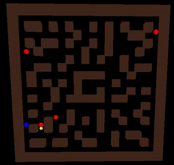
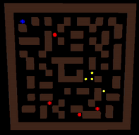
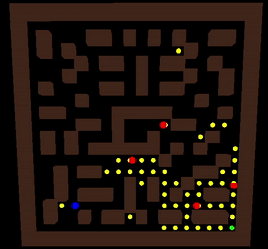

# Pacman (Intelligent Multiagent Systems) #

University project.

The main idea was to implement Pacman and ghosts as independent intelligent agents. Agents have limited view, they cannot see more than few blocks ahead and also cannot see items blocked by the walls.

### Pacman ###

He works alone. 

In my implementation Pacman is using DFS algorithm to evaluate what the best move is. He has no memory of states he visited previously. He runs away from the ghosts unless he recently picked up a "power up", in which case he tries to eat the ghosts. Pacman is not trying to pick up "power up" if no ghost is chasing him. Avoiding walls is also a good thing for Pacman to do because they reduce his visibility. There is also a big possibility of a dead end in the regions with lots of walls.

If Pacman goes for too much time without collecting any food, he will become hungry and start to use metadata to move away from his region and start to explore other places. 

### Ghosts ###

They are trying to work "together" to catch mr. Pacman. They do not actually make decisions together, but the resut of their actions should make them look like they cooperate.

A ghost first checks if he can se Pacman near him. If he can, then he moves towards him. If the Pacman is under power up, the ghost should run away from him (sadly, this framework does not provide this information to ghosts). If ghost sees Pacman, he writes that information down into metadata for other ghosts.

Ghost that don't see Pacman near them check the metadata to find out if some other ghost has seen Pacman and uses that information to move. 

The third option is to explore and move randomly. Ghosts do not move totally random, they are attracted towards food (because they assume Pacman will eventually have to collect it if he wants to win the game) and towards walls (so they can't be seen). They move away from other ghosts to explore more space, and they also move away from power ups to avoid getting eaten.

### How do they work ###

Pacman works really great when playing against default ghosts provided by the framework. In that case he is able to win the game. 
My ghosts make things harder for him. When small amounts of food remain in the game, ghosts get attracted to them and that causes Pacman to get away from that food. This makes collecting remaining food really hard for Pacman.

#### My Pacman vs. default ghosts:

Finding remaining food:

#### My Pacman vs. my ghosts:

Ghosts are waiting for the Pacman in the region rich with food

